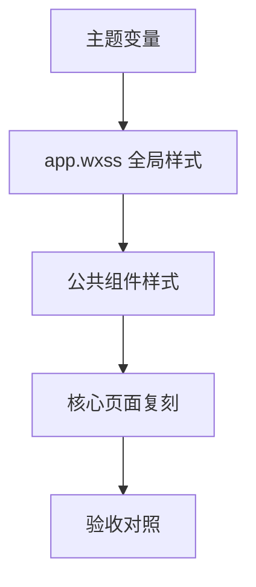

# new-front 样式复刻到小程序的方案（核心导航页优先）

## 目标与范围
- 目标：按 `new-front` 样式一比一复刻小程序核心导航页，并建立全局主题与组件样式映射
- 范围：`Home`、`Market`、`Ranking`、`Profile`、`ContractDetail`、`CreateContract`、`Arbitration`、`TopUp`
- 约束：后端未实现部分先静态页面展示

## 1) 全局样式入口与主题变量映射
### new-front 入口
- `index.css` 仅负责导入：[`new-front/src/styles/index.css`](new-front/src/styles/index.css:1)
- Tailwind & 动画：[`new-front/src/styles/tailwind.css`](new-front/src/styles/tailwind.css:1)
- 主题变量与公共类：[`new-front/src/styles/theme.css`](new-front/src/styles/theme.css:1)

### 主题变量（迁移到小程序 app.wxss）
来源：[`new-front/src/styles/theme.css`](new-front/src/styles/theme.css:1)
- 颜色
  - `--background`: `#f7f8fa`
  - `--foreground`: `#1a1a1e`
  - `--card`: `#ffffff`
  - `--card-foreground`: `#1a1a1e`
  - `--primary`: `#d9a42b`
  - `--primary-foreground`: `#ffffff`
  - `--secondary`: `#f1f3f5`
  - `--muted`: `#f1f3f5`
  - `--muted-foreground`: `#8e9aaf`
  - `--accent`: `#d9a42b`
  - `--destructive`: `#fa5252`
  - `--border`: `#e9ecef`
  - `--ring`: `#d9a42b`
- 圆角
  - `--radius`: `1rem`
- 公共类
  - `.glass`：玻璃背景与模糊
  - `.card-shadow`：轻阴影
  - `.gold-gradient`：金色渐变
  - `.no-scrollbar`：隐藏滚动条

### 小程序全局落地策略（app.wxss）
参考现状：[`frontend-weapp/app.wxss`](frontend-weapp/app.wxss:1)
- 使用 `page` 与自定义变量实现主题
- 提供公共类与工具类，覆盖现有蓝色主题
- 统一字号与间距体系，保证视觉一致性

> 目标：用 `app.wxss` 实现主题变量与公共类，页面 wxss 只写布局与页面特有样式

## 2) 核心页面与组件依赖对照
路由来源：[`new-front/src/app/routes.tsx`](new-front/src/app/routes.tsx:1)

| new-front 页面 | 小程序页面 | 备注 |
| --- | --- | --- |
| `Home` | `pages/contracts/list` | 我的契约列表 |
| `Market` | `pages/hall/list` | 契约大厅 |
| `Ranking` | `pages/ranking/index` | 信誉排行 |
| `Profile` | `pages/profile/profile` | 个人中心 |
| `ContractDetail` | `pages/contracts/detail` | 契约详情 |
| `CreateContract` | `pages/contracts/create` | 发起契约 |
| `Arbitration` | `pages/dispute/index` + `pages/dispute/apply` | 仲裁中心与申请 |
| `TopUp` | 新增页面 `pages/credit/topup` 或扩展 `pages/credit/credit` | 信誉分充值 |

核心组件与样式来源
- 底部导航：[`new-front/src/app/components/BottomNav.tsx`](new-front/src/app/components/BottomNav.tsx:1)
- 契约卡片：[`new-front/src/app/components/ContractCard.tsx`](new-front/src/app/components/ContractCard.tsx:1)

## 3) 小程序端全局主题落地方案
### 命名规范
- 主题变量：`--color-*` / `--radius-*` / `--shadow-*`
- 公共类：`g-` 前缀，例如 `g-card`、`g-chip`、`g-glass`
- 页面容器：`page-root`、`page-section`

### 基础样式（app.wxss）建议结构
- 颜色变量
- 字体与字号
- 圆角与阴影
- 按钮基础
- 卡片基础
- 标签与徽章
- 列表与分割线
- 玻璃效果与金色渐变

## 4) 组件样式映射策略
### Button
- 主按钮：金色背景、圆角 22px~28px、阴影、字重 700~900
- 次按钮：白底金边、浅金 hover 背景
- 危险按钮：红色背景 `#fa5252`

### Card
- 背景白、圆角 24px~48px
- 轻阴影 `0 4px 20px rgba(0,0,0,0.04)`
- 细边框 `1px solid rgba(0,0,0,0.05)`

### Tabs
- 轻灰底容器 + 白色激活态卡片
- 激活文字金色

### Badge / Status
- 金色、绿色、红色三类
- 圆角胶囊，字重 700

### List / Menu Item
- 左图标 + 标题 + 右箭头
- 触发态背景浅金 `#fcf8e8`

### Bottom Nav
- 玻璃背景 + 阴影
- 激活态金色 + 放大

## 5) 逐页改造清单（核心页）
### Home -> `pages/contracts/list`
来源：[`new-front/src/app/pages/Home.tsx`](new-front/src/app/pages/Home.tsx:1)
- 标题区 + 金色主按钮
- 搜索框（浅灰底、圆角、聚焦金色）
- 横向 Tabs
- 契约卡片复刻 `ContractCard`
- 空态展示

### Market -> `pages/hall/list`
来源：[`new-front/src/app/pages/Market.tsx`](new-front/src/app/pages/Market.tsx:1)
- 顶部图标按钮 + 标题
- 游戏类型下拉与搜索
- 卡片型列表（大圆角、封面图渐变遮罩）
- CTA 按钮金色
- 空态图标

### Ranking -> `pages/ranking/index`
来源：[`new-front/src/app/pages/Ranking.tsx`](new-front/src/app/pages/Ranking.tsx:1)
- 顶部标题 + 提示 icon
- 更新时间卡片（浅金）
- 红榜/黑榜双列对照 + 分隔线
- 底部说明

### Profile -> `pages/profile/profile`
来源：[`new-front/src/app/pages/Profile.tsx`](new-front/src/app/pages/Profile.tsx:1)
- 头像、徽章、ID
- 信誉与余额卡片
- 签到模块（7日阶梯）
- 统计卡片
- 菜单列表
- 退出按钮

### ContractDetail -> `pages/contracts/detail`
来源：[`new-front/src/app/pages/ContractDetail.tsx`](new-front/src/app/pages/ContractDetail.tsx:1)
- 头部蒙层返回按钮
- 大图封面 + 状态徽章
- 内容卡片（超大圆角）
- 发行方信息卡
- Tabs 内容
- 条款与进度区块

### CreateContract -> `pages/contracts/create`
来源：[`new-front/src/app/pages/CreateContract.tsx`](new-front/src/app/pages/CreateContract.tsx:1)
- 标题/类型/搜索下拉
- 开关样式
- 多文本输入框
- 提交按钮

### Arbitration -> `pages/dispute/index` + `apply`
来源：[`new-front/src/app/pages/Arbitration.tsx`](new-front/src/app/pages/Arbitration.tsx:1)
- 历史列表（时间线+卡片）
- 申请表单（下拉+文本+上传占位）

### TopUp -> `pages/credit/topup`
来源：[`new-front/src/app/pages/TopUp.tsx`](new-front/src/app/pages/TopUp.tsx:1)
- 信息卡 + 充值包卡片
- 支付方式选择
- 风险提示
- 底部主按钮

## 6) 验收清单
- 颜色：背景/主色/文本/边框严格匹配
- 圆角：卡片 24~48px 级别，按钮 22~28px
- 阴影：轻阴影 + 金色 glow
- 间距：主容器 24~32px
- 字重：标题 800~900、正文 500~700
- 交互：按钮轻微缩放、tabs 下划线
- 图标：与 `lucide-react` 视觉等效的微信图标或 SVG

## Mermaid 结构示意

## 下一步执行（进入代码模式）
- 创建 `app.wxss` 主题变量与公共类
- 按页面逐个复刻核心布局与样式
- 后端未实现区块使用静态数据占位
- 最后统一验收与微调
